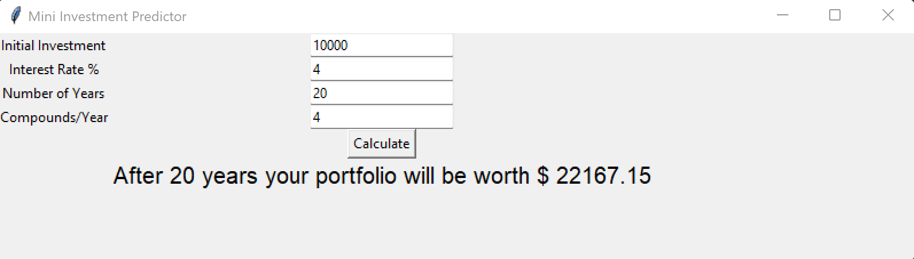

# mini_investment_predictor
## Predicts future investment values

### Enter your initial investment, interest rate, years in the future and compound rate to get an estimate of your future portfolio value.

This is a CLI application. This can be run by changing the directory to where this file is stored by entering:

```python
    cd Mini_Investment_Predictor
    python mini_investment_predictor.py
```

### Example



